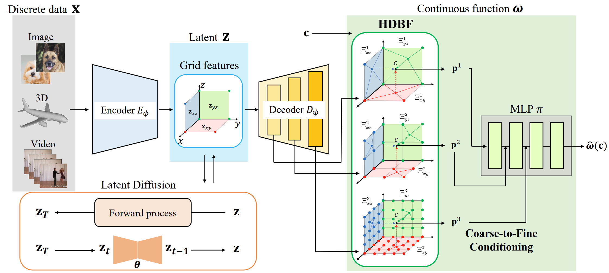

# DDMI: Domain-Agnostic Latent Diffusion Models for Synthesizing High-Quality Implicit Neural Representations
**[Project Page](https://dogyunpark.github.io/ddmi) |
[Paper](https://arxiv.org/abs/2401.12517)**

Dogyun Park,
Sihyeon Kim,
Sojin Lee,
Hyunwoo J. Kim†.

This repository is an official implementation of the ICLR 2024 paper DDMI (Domain-Agnostic Latent Diffusion Models for Synthesizing High-Quality Implicit Neural Representations). We propose a latent diffusion model that generates hierarchically decomposed positional embeddings of Implicit neural representations, enabling high-quality generation on various data domains.

<div align="center">
  
</div>

## Note
Data preparation, training codes for occupancy, NeRF, and video, and checkpoints for the pretrained models will be released soon after the code refactoring.

## Setup
To install requirements, run:
```bash
git clone https://github.com/mlvlab/DDMI.git
cd DDMI
conda create -f requirements.yaml
conda activate ddmi
```

## Data Preparation
### Image
We have utilized two datasets for our experiments: [AFHQ-V2](https://github.com/clovaai/stargan-v2) and [CelebA-HQ](https://github.com/tkarras/progressive_growing_of_gans). You may change the location of dataset by changing `data_dir` of config files in `configs/`.

## Training
To train other signal domains, you may change the `domain` of config files in `configs/`. By default, the model's checkpoint will be stored in `./results`.
### First-stage training (D2C-VAE)
```bash
CUDA_VISIBLE_DEVICES=0,1,2,3 accelerate launch --multi_gpu --num_processes=4 main.py --exp d2c-vae --configs configs/d2c-vae/img.yaml
```

### Second-stage training (LDM)
```bash
CUDA_VISIBLE_DEVICES=0,1,2,3 accelerate launch --multi_gpu --num_processes=4 main.py --exp ldm --configs configs/ldm/img.yaml
```

## Generation
You can generate a signal from the pretrained model in `./results` by changing the `mode` of config files to `eval` from `train`, then run:
```bash
python main.py --exp ldm --configs configs/ldm/img.yaml
```
For arbitrary-resolution 2D image generation, you can change `test_resolution`  of config files.


## Acknowledgement
This repo is built upon [ADM](https://github.com/openai/guided-diffusion) and [latent-diffusion](https://github.com/CompVis/latent-diffusion).

## Citation
```bibtex
@article{park2024ddmi,
  title={DDMI: Domain-Agnostic Latent Diffusion Models for Synthesizing High-Quality Implicit Neural Representations},
  author={Park, Dogyun and Kim, Sihyeon and Lee, Sojin and Kim, Hyunwoo J},
  journal={arXiv preprint arXiv:2401.12517},
  year={2024}
}
```


